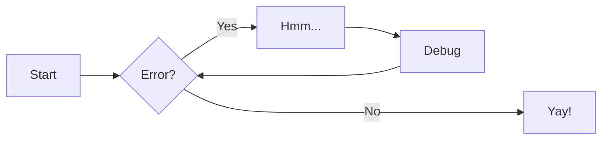

| Workshop |            Site            |    Repository     |       Reference        |    Instructor Notes    |
| -------- | :------------------------: | :---------------: | :--------------------: | :--------------------: |
| ABC      | :material-window-maximize: | :material-github: | :material-eye-outline: | :material-plus-circle: |
| DEF      | :material-window-maximize: | :material-github: | :material-eye-outline: | :material-plus-circle: |
| GHI      | :material-window-maximize: | :material-github: | :material-eye-outline: | :material-plus-circle: |

## Requirements Workflow

## Workshop Checklist

If you are planning to run a Pumas workshop please make sure you have checked
for all of the items above:

1. :material-check: **Decide on which workshop curriculum** from the PLACEHOLDER
   would best serve your learners.
   Check for all the pre-requisites in the curriculum,
   specially previous pharmacometrics knowledge.
   Some workshops curricula depend on another workshop curriculum
   for the best learning experience,
   make sure that your learners can fully enjoy the workshop you are planning.
   Finally, all of the workshops curricula have learning personas,
   learning objectives, teaching notes, and timetables.
   For the best experience, we recommend following them.
1. :material-check: **Clone the desired workshop template repository** by clicking the
   GitHub green button "Use this template".
   This will create a copy of the workshop template as your personal repository.
   We don't recommend additions or modifications to the curriculum,
   except for changing the data files examples.
1. :material-check: **Rehearse** at least once with the curriculum timetables to build confidence
   and also make sure that the workshop will be properly conducted.
   Check the teaching notes to avoid common pitfalls
   while conducting the workshop.
1. :material-check: **Arrange for all required materials and equipment**.
   If your workshop is virtual provide an online meeting platform
   with the required capabilities for screen sharing and
   attendees participation.
   If your workshop is on premises provide the space, seating,
   and any other necessary equipment such as projectors
   to the execution of the workshop;
   don't forget to plan for coffee breaks with beverages and food.
   If you plan to record your workshop, either virtual or on premises,
   make sure you have the consent for all attendees, and,
   if necessary the hosting institution.
1. :material-check: **Email learners with instructions** on how to have access to Pumas,
   installation procedures, and any other requirements such as
   downloading data and code.
1. :material-check: **Keep close contact with learners** by reminding them about deadlines,
   and emailing them a couple days before the workshop to remind them
   about any requirement.
